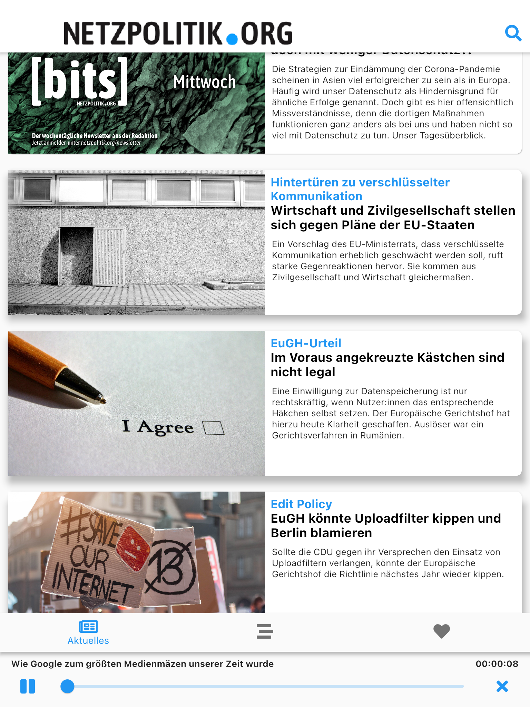
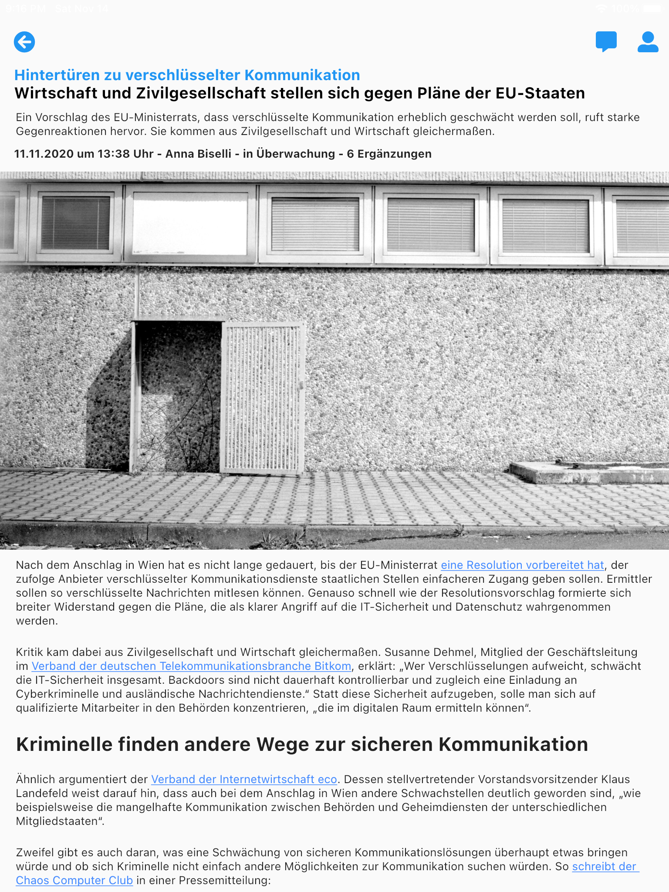
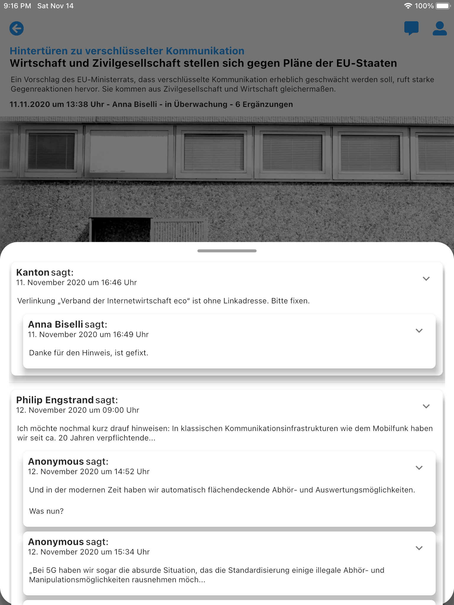

# 📚 Netzpolitik Mobile App

This is an unofficial cross-plattform flutter mobile app for reading [netzpolitik.org](https://netzpolitik.org/) articles.
It is using the open [Wordpress Rest API](https://developer.wordpress.org/rest-api/) of the netzpolitik website.

 

> netzpolitik.org ist ein Medium für digitale Freiheitsrechte. Wir thematisieren die wichtigen Fragestellungen rund um Internet, Gesellschaft und Politik und zeigen Wege auf, wie man sich auch selbst mit Hilfe des Netzes für digitale Freiheiten und Offenheit engagieren kann. Mit netzpolitik.org beschreiben wir, wie die Politik das Internet durch Regulierung verändert und wie das Netz Politik, Öffentlichkeiten und alles andere verändert.

 

## ⭐️ Features

- [x] Reading articles
- [x] Reading comments of an article
- [x] Getting information about the author of an article
- [x] Hearing podcasts

## 📱 Screenshots

Here are some screenshots made on an iPad Pro (9.7 inch). Please note the embedded Audio-Player in the first screenshot.
It is only visible when a podcast is currently playing.

<table>
    <tr>
        <td>  </td>
        <td>  </td>
        <td>  </td>
    </tr>
</table>
  

