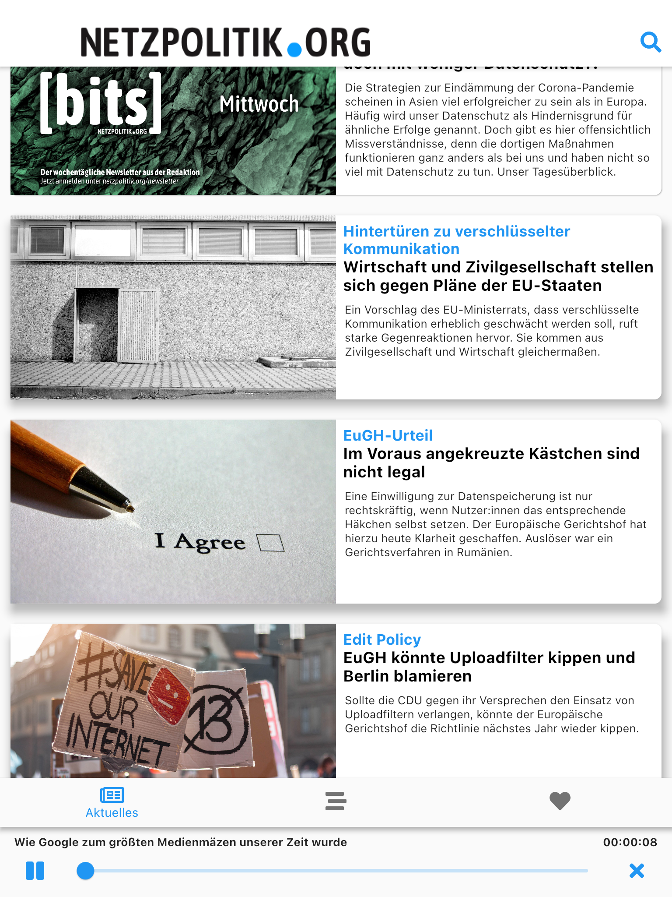
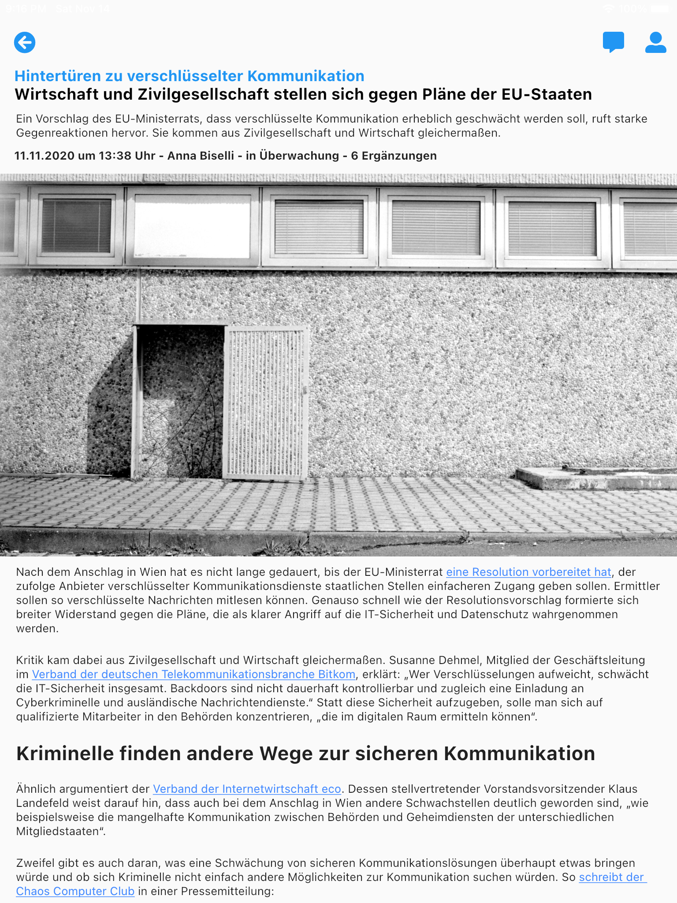
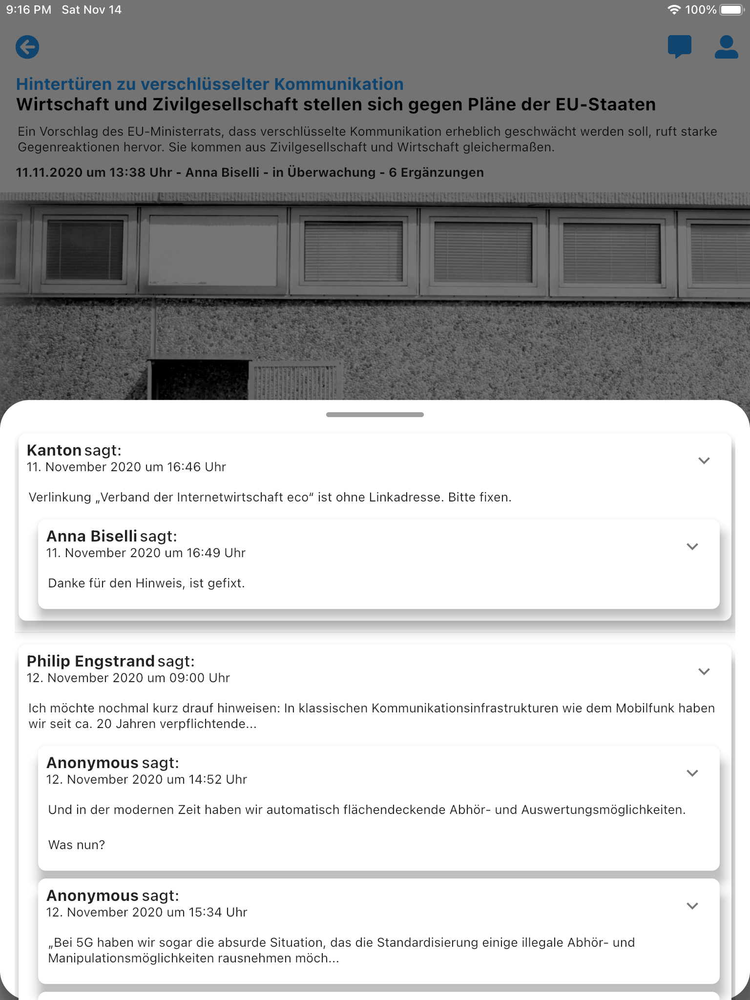

# 📚 Wordpress Blog App Template

A generic flutter app template for wordpress apps using [Wordpress Rest API](https://developer.wordpress.org/rest-api/)
The example is written for [Netzpolitik.org](https://netzpolitik.org/)

<br>

# 📱 Screenshots

<table>
    <tr>
        <td>  </td>
        <td>  </td>
        <td>  </td>
    </tr>
</table>
<br><br>


# 📗 Development Guide


## 💾 Serialization

The model serialization is done by the [json_serializable](https://pub.dev/packages/json_serializable) plugin, which uses [json_annotation](https://pub.dev/packages/json_annotation) to generate `{file_name}.g.dart` files, which contains the generated json serialization code.
A detailed how-to for this can be found [here](https://flutter.dev/docs/development/data-and-backend/json)

For a one-time generation of the serialization code run:
```
flutter pub run build_runner build --delete-conflicting-outputs
```

For starting a `watcher` who automatically regenerates the code after saving changes run:
```
flutter pub run build_runner watch --delete-conflicting-outputs
```

## 🇷🇺 Localization

The localization logic is implemented in [app_localizations.dart](lib/localization/app_localizations.dart). 
All the translation are placed in `localizations/{locale-code}.json` files. 

On app start the app will read the file matching the locale of the device (and `de.json` as fallback). To get a translated string for a specific key use:
```
AppLocalizations.of(context).translate('my_awesome_key')
```
or import the [context extensions](lib/extensions/context_ext.dart) and use it like you would in android:
```
context.getString('my_awesome_key')
```

## 🏞 Generate App Icon

The native app icon generation is done by the [flutter_launcher_icons package](https://pub.dev/packages/flutter_launcher_icons) package.
It very simple - Just configure which image to use as the icon in the [pubspec.yaml](pubspec.yaml) under the tag `flutter_icons` and then run:
```
flutter pub get
flutter pub run flutter_launcher_icons:main
```
That's it.

## 👨🏻 Generate App Name

The native display name gneration is done by the [flutter_launcher_name](https://pub.dev/packages/flutter_launcher_name) package.
It is as easy as chaning the icon - Just configure the name in the [pubspec.yaml](pubspec.yaml) under the tag `flutter_launcher_name` and then run:
```
flutter pub get
flutter pub run flutter_launcher_name:main
```
That's it.

## 🚀 CI / CD

The CI is currently realized using [GitHub Actions](https://github.com/features/actions). 
All jobs are defined in [test.yml](.github/workflows/test.yml) and [build_debug.yml](.github/workflows/build_debug.yml).
It is configured like:
    - Static code analysis and all tests are running on each push
    - Android & iOS Debug builds are running on each push on every branch except main 
    
 